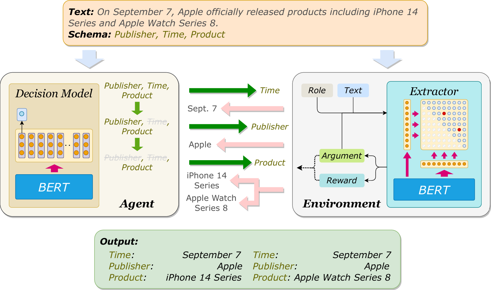

## README

Implementation of the ACL23 findings paper: Adaptive Ordered Information Extraction with Deep Reinforcement Learning.

## What we do in this work?
In this work, we propose a novel **adaptive ordered** information extracion (IE) paradigm to find the optimal element extraction order for different instances. Specifically, we propose to adopt value-based reinforcement learning in determining the optimal extraction order for elements of an instance. In deciding the next extraction element for an instance, every of its unextracted elements will be evaluated with a potential benefit score, which is calculated with a BERT-based model. Then, the one with the highest potential benefit score will be selected as the next extraction object.



## Usage

### Quick start

As a prerequisite, you must have PyTorch installed to use this repository.
You can use the following code to build a virtual conda environment for reproducing our work.

```
# Clone the Adaptive Order Extraction repository
git clone https://github.com/EZ-hwh/AutoExtraction

# Create a conda environment
conda create -n adaptive_extraction python=3.9
conda activate adaptive_extraction

# Install required dependencies
pip install -r requirements.txt
```

### Training
If you want to train your own model in a new dataset.
```
# First train the extraction model for dataset split 1,2 and the whole dataset.
python extraction.py --do_train=True --plm=hfl/chinese-bert-wwm-ext --weight_file=duee/ext_1.pt --dname=DuEE1.0 --data_split 1
python extraction.py --do_train=True --plm=hfl/chinese-bert-wwm-ext --weight_file=duee/ext_2.pt --dname=DuEE1.0 --data_split 2
python extraction.py --do_train=True --plm=hfl/chinese-bert-wwm-ext --weight_file=duee/ext.pt --dname=DuEE1.0 --data_split 0

# Then crossly train the value-based reinforcement learning decision model with two extraction model.
python DQN.py --dname=DuEE1.0 --do_train=True --plm=hfl/chinese-bert-wwm-ext --weight_file=rl_duee.pt --buf_size=100000 --reward_type=v3 --data_split=1
python DQN.py --dname=DuEE1.0 --do_train=True --plm=hfl/chinese-bert-wwm-ext --weight_file=rl_duee.pt --buf_size=100000 --reward_type=v3 --data_split=2
```

### Extraction
Example command for running extraction:
```
python predict.py --plm=bert-base-cased --dataset=DuEE1.0 --lang==zh --model_name=duee
```

## Citation
```
@inproceedings{Huang_2023,
   title={Adaptive Ordered Information Extraction with Deep Reinforcement Learning},
   url={http://dx.doi.org/10.18653/v1/2023.findings-acl.863},
   DOI={10.18653/v1/2023.findings-acl.863},
   booktitle={Findings of the Association for Computational Linguistics: ACL 2023},
   publisher={Association for Computational Linguistics},
   author={Huang, Wenhao and Liang, Jiaqing and Li, Zhixu and Xiao, Yanghua and Ji, Chuanjun},
   year={2023},
   pages={13664–13678} 
}
```
